
<h1 align="center">校园组团平台</h1>

## 简介
校园组团平台：基于Spring Boot开发，角色分为管理员和用户；提供活动创建与管理、用户注册登录、公告管理、活动审核与参与、个人信息管理等功能，助力提升校园活动组织效率和交流体验。    --计算机毕业设计源码；毕设源码；java毕业设计源码

## 联系方式

<h3 align="center">获取完整代码与数据库文件 + 微信：deepguan QQ: 86050149 QQ群: 783742310</h3>

<h3 align="center">可帮忙远程部署 包运行成功！提供远程部署、修改代码、设计文档指导、代码讲解等服务！</h3>

## 功能介绍（完整见运行截图）
管理员：管理员可以访问并管理后台功能，包括用户管理、活动管理和公告管理。支持对用户数据的增删改查，审批活动申请，发布和编辑公告信息。通过平台提升社团活动的组织效率，并确保用户信息的准确性和系统运作的高效。

用户：用户能够注册和登录平台，查看并参与校园活动，管理个人信息。用户可以报名参与活动，使用“赞”和“踩”功能对活动进行反馈，并查看活动的详细信息和公告。个人中心允许用户修改个人资料，查看和管理收藏的活动，提高参与校园活动的便利性。

## 运行截图
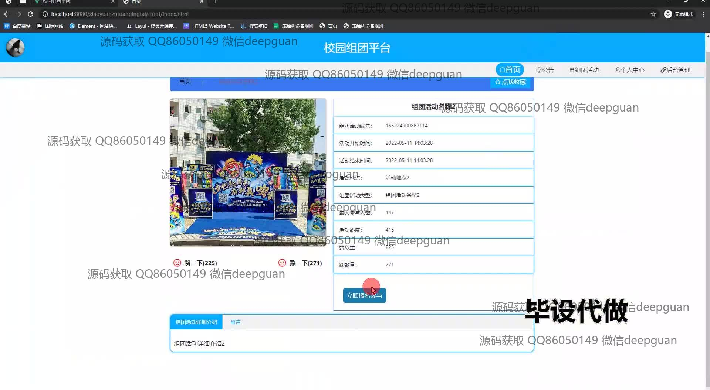
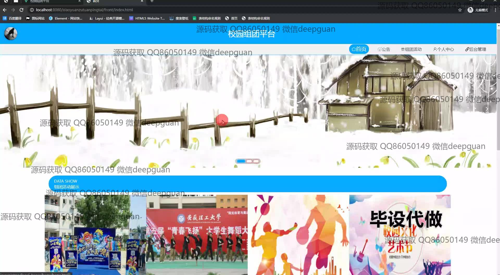
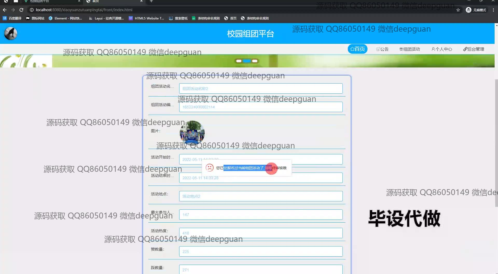
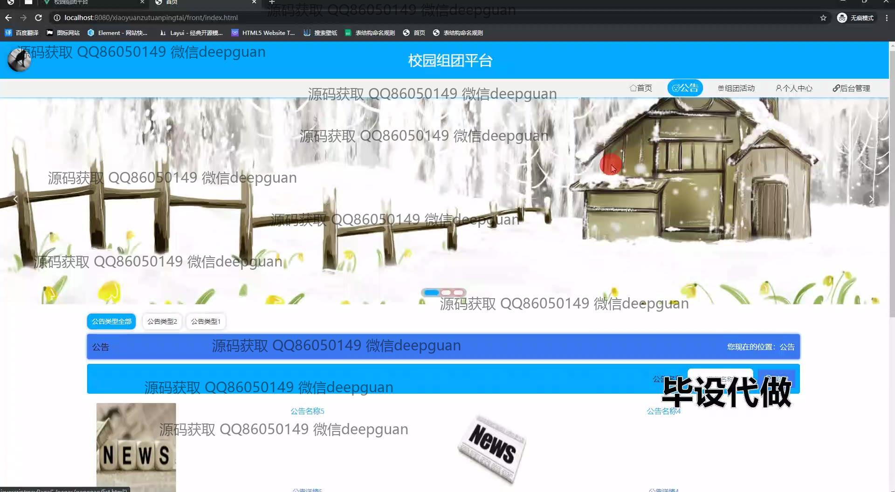
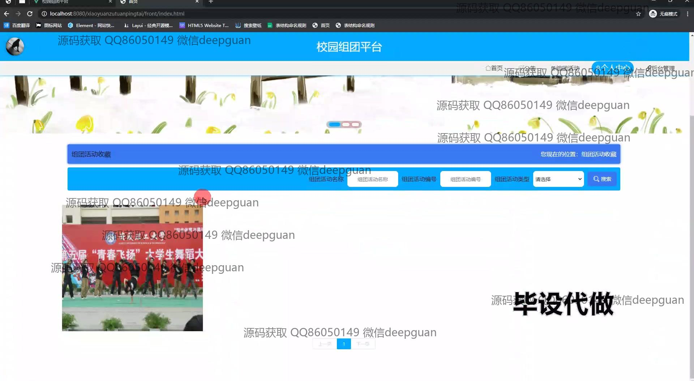
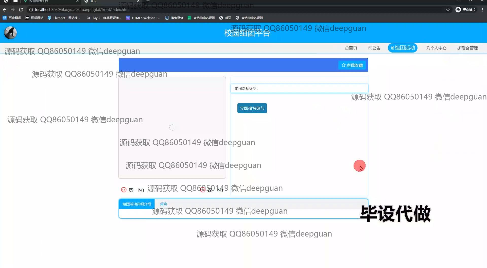
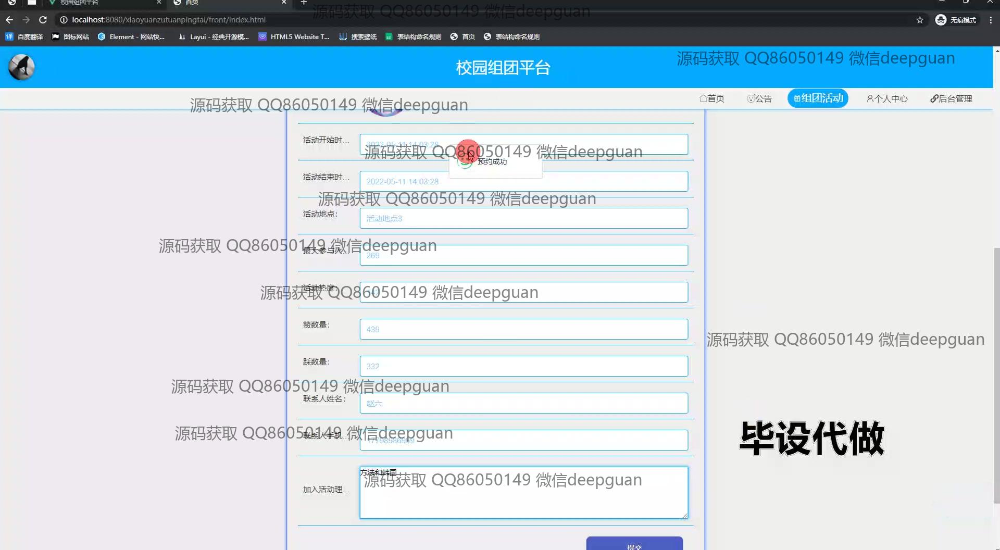
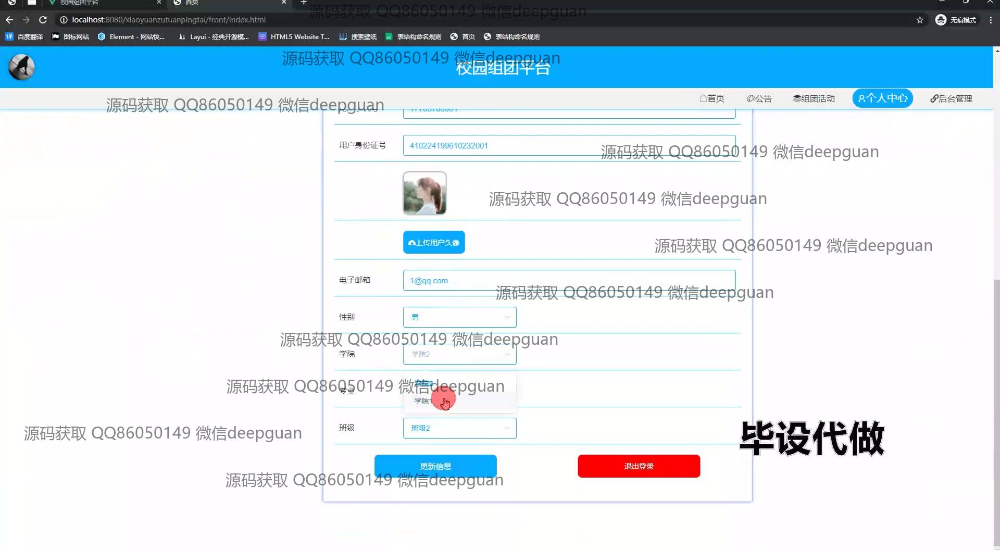
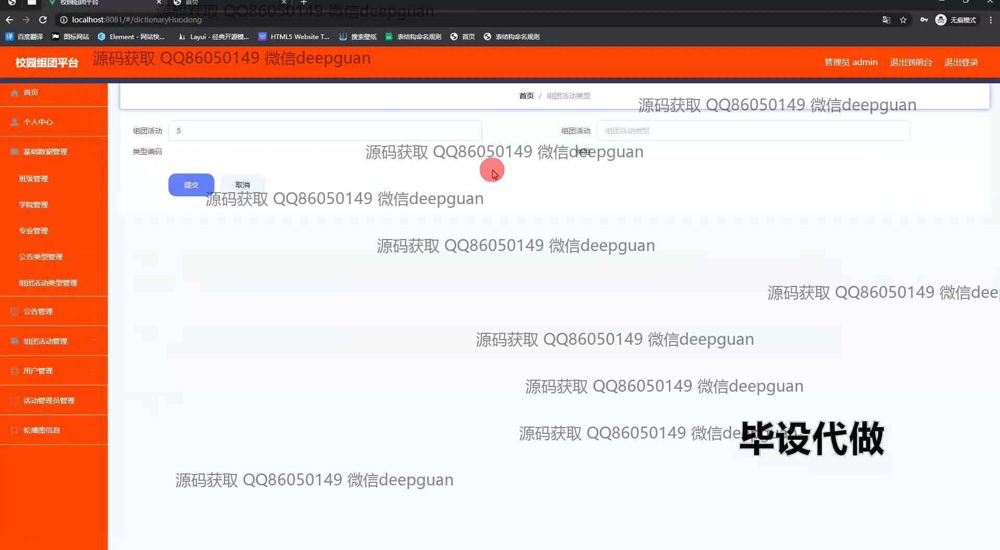
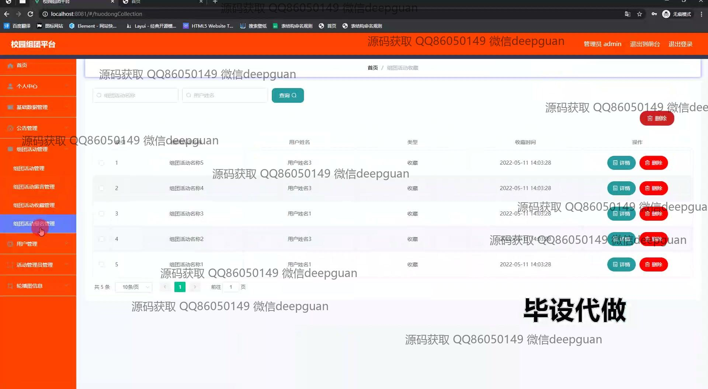
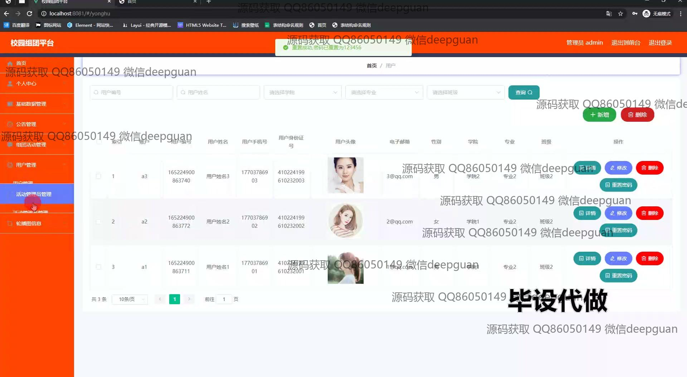
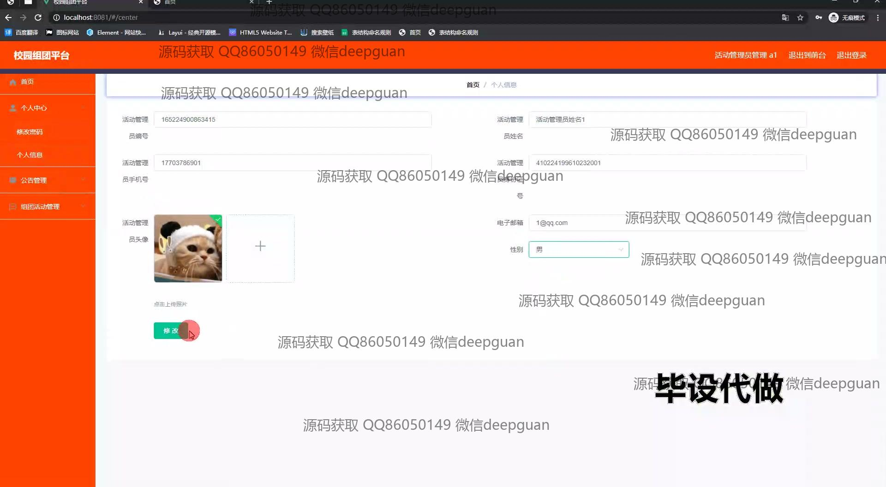
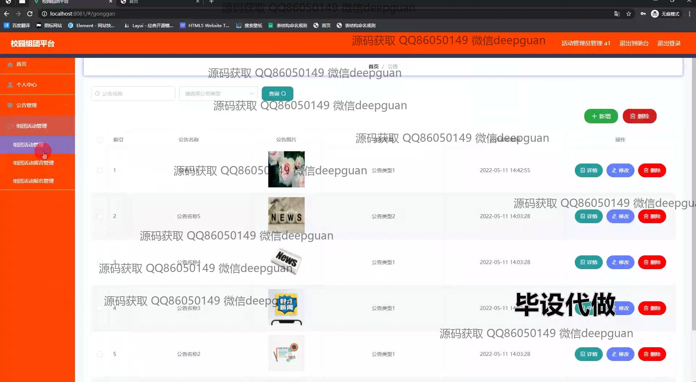
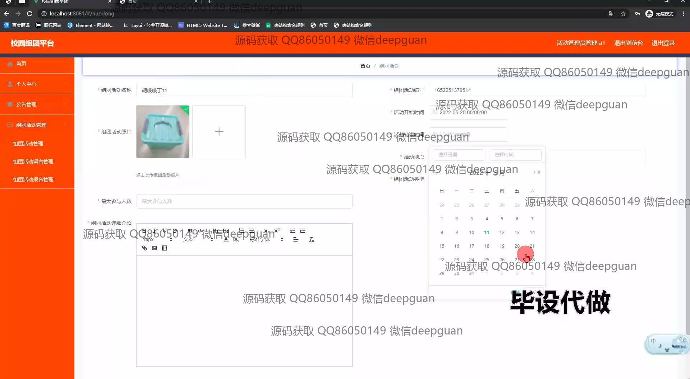
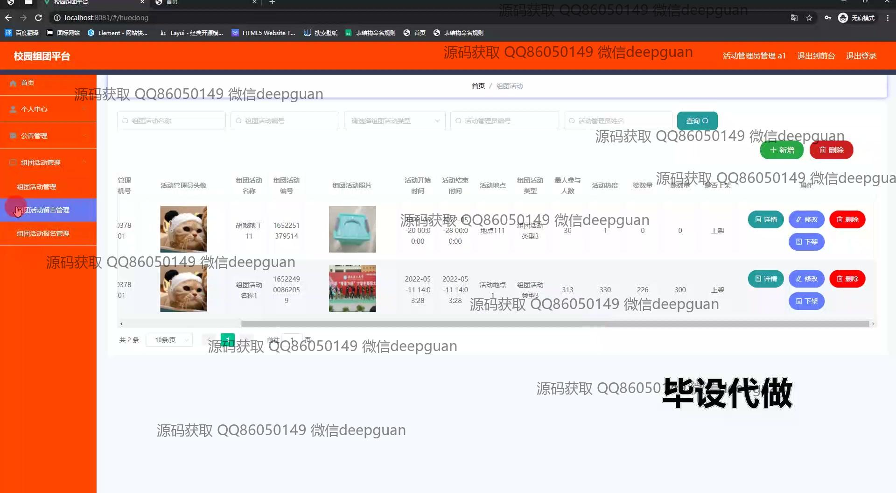
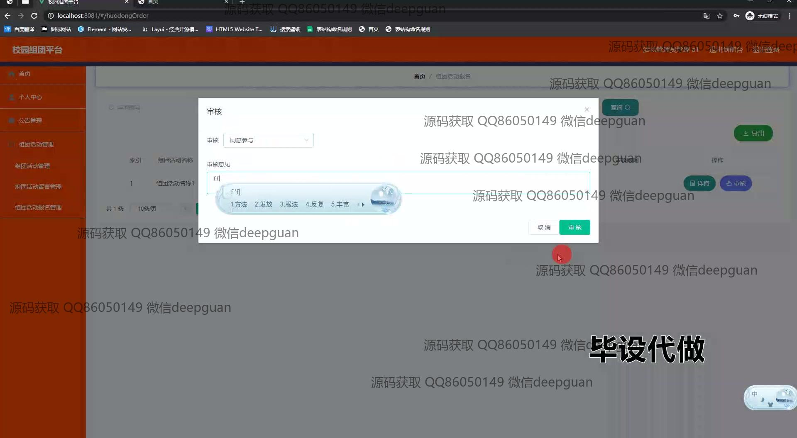

本代码来源于网络,仅供学习参考使用!

